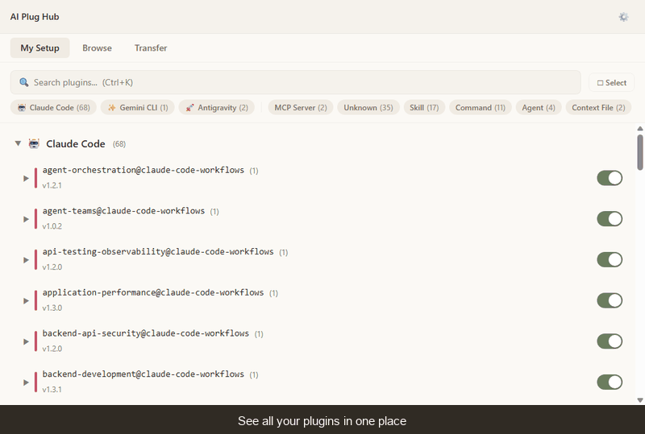
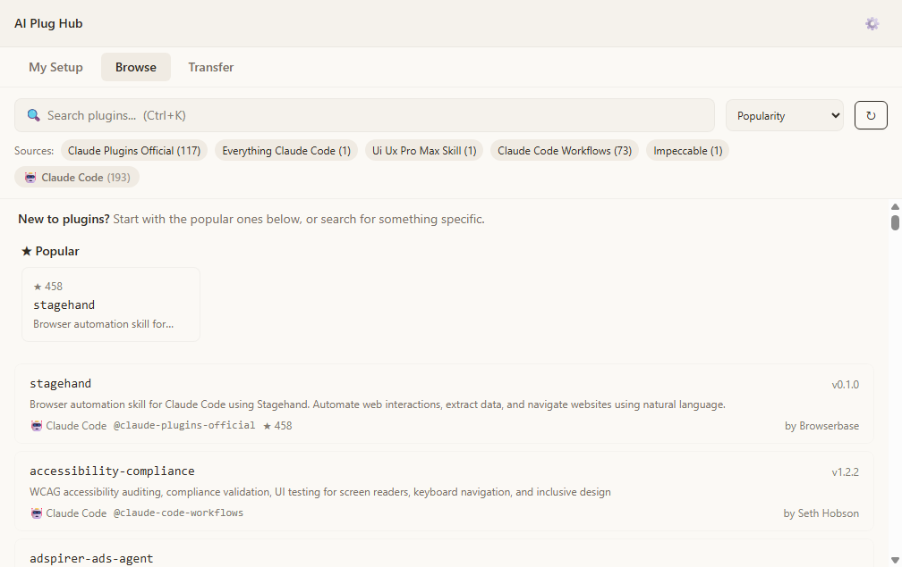

# AI Plug Hub

**One app to manage plugins across all your AI tools.**



Your AI tools each have their own plugins, their own config files, and their own install steps. AI Plug Hub puts everything in one place — browse, install, and share plugins across Claude Code, Claude Desktop, Gemini CLI, and Antigravity without memorizing each tool's config format.

## What it does

- **See all your plugins in one view** — user-level and project-level, across every tool
- **Browse and install** from curated marketplaces and community sources, with star counts and featured picks
- **Export scoped bundles** — scope to a team or project and share only what's relevant
- **Compare bundles** side-by-side before importing to review what changes
- **Check for updates** — detect available updates and review changes before applying
- **Enable, disable, or uninstall** any plugin from any supported tool
- **Bulk operations** — select multiple plugins and act on them at once
- **Backup and restore** — snapshot your config before experimenting
- **Keyboard navigation** — full keyboard nav across all tabs
- **Guided first-run** — Getting Started walkthrough with type education and featured plugins



## Supported tools

| Tool | What it is |
|------|-----------|
| **Claude Code** | Anthropic's CLI coding assistant |
| **Claude Desktop** | Anthropic's desktop chat app |
| **Gemini CLI** | Google's CLI coding assistant |
| **Antigravity** | AI-powered IDE with skills, workflows, and extensions |

AI Plug Hub manages all plugin types each tool supports: MCP servers, skills, commands, agents, hooks, and context files.

## Download

Grab the latest release:

- [Windows installer (.exe)](https://github.com/ThanhWilliamLe/AIPlugHub/releases/latest/download/aiplughub-windows-x64-installer.exe)
- [Windows portable (.exe)](https://github.com/ThanhWilliamLe/AIPlugHub/releases/latest/download/aiplughub-windows-x64-portable.exe) — no install, runs directly
- macOS — coming soon
- Linux — coming soon

[All releases](https://github.com/ThanhWilliamLe/AIPlugHub/releases)

## Build from source

```bash
git clone https://github.com/ThanhWilliamLe/AIPlugHub.git
cd AIPlugHub
npm install
npm run dev
```

Requires Node.js 18+ and Rust (Tauri).

## Scripts

```
npm run dev          # Launch with hot reload
npm run build        # Production build
npm run dist         # Build + package Windows installer
npm test             # Run tests (1,907 passing)
npm run lint         # ESLint
npm run typecheck    # TypeScript strict check
npm run test:e2e     # Playwright E2E tests
```

## Tech stack

- **Tauri 2** — cross-platform desktop shell (Rust backend)
- **React 19 + TypeScript 5.9** — frontend
- **Tailwind v4 + Radix UI** — styling and accessible primitives
- **Zustand** — state management
- **Fuse.js** — client-side fuzzy search
- **Vitest + React Testing Library** — 1,907 unit/integration tests
- **Playwright** — E2E tests

## Preview release

AI Plug Hub is in **public preview**. Core features are implemented and backed by 1,907 tests (including endurance suites), but it hasn't had wide real-world usage yet. Windows is available now; macOS and Linux are coming soon.

This is real software you can download and run today — not a prototype, not a waitlist. Your feedback will shape what comes next.

## Feedback

The most helpful thing you can do right now is try it and report what happens.

[Open an issue](https://github.com/ThanhWilliamLe/AIPlugHub/issues)

What's most useful:

- Bug reports with steps to reproduce
- Which AI tools you use and how the detection worked (or didn't)
- Plugins that failed to install or didn't show up
- Anything confusing in the UI

## License

MIT — see [LICENSE](LICENSE) for details.
