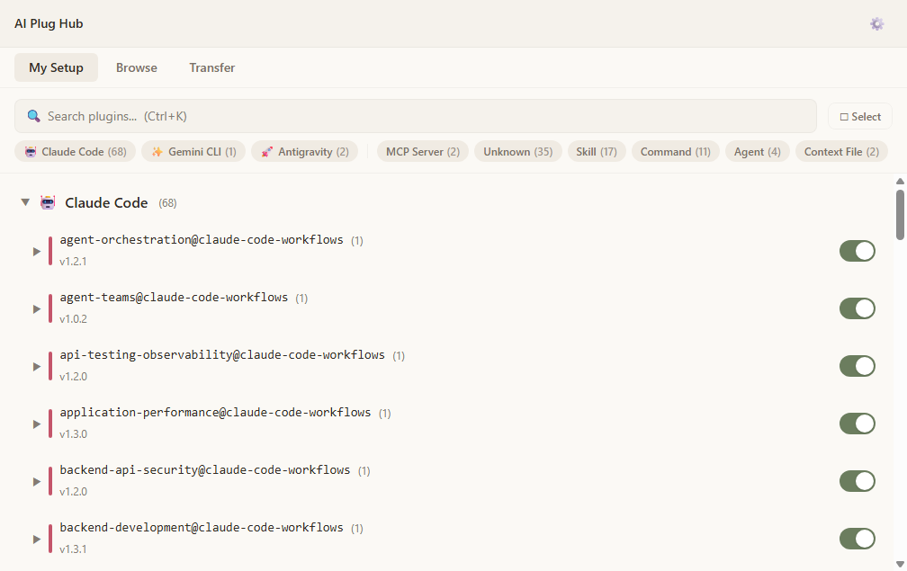
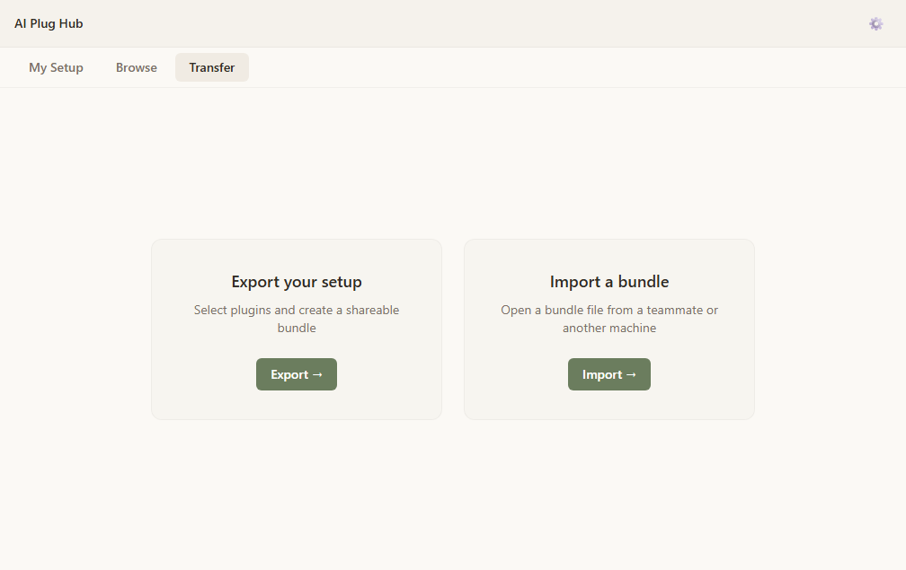

# AI Plug Hub

**The easiest way to manage your AI tool plugins.**

Tired of editing JSON files to add a plugin? AI Plug Hub gives you a visual interface to browse, install, and manage plugins -- whether you use one AI tool or several. It works with Claude Code, Claude Desktop, Gemini CLI, and Antigravity, reading and writing each tool's native config files directly (no proprietary layer). Export your setup as a bundle to share with teammates or move to a new machine.

> **What's a plugin?** Plugins add capabilities to your AI tools -- things like web search, file editing, code analysis, connecting to Slack or databases, and more. AI Plug Hub manages all of them in one place.



## What it does

**Everyday use:**
- **Browse and install** from marketplace sources, sorted by popularity with star counts
- **See all your plugins in one view** -- personal and project-level, all in one place
- **Check for updates** -- detect available updates and review changes before applying
- **Enable, disable, or uninstall** any plugin from any supported tool

**For teams and power users:**
- **Export your setup** as a bundle file and onboard your whole team to the same config
- **Import a bundle** on a new machine and get the exact same setup quickly
- **Bulk operations** -- select multiple plugins and act on them at once
- **Backup and restore** -- snapshot your settings before experimenting
- **Project-scope plugins** -- manage plugins scoped to specific project folders

## Supported tools

| Tool | What it is | What AI Plug Hub manages |
|------|-----------|--------------------------|
| **Claude Code** | Anthropic's coding assistant | MCP servers, skills, commands, hooks, agents, context files |
| **Claude Desktop** | Anthropic's desktop chat app | MCP servers |
| **Gemini CLI** | Google's coding assistant | MCP servers, skills, commands, hooks, agents, context files |
| **Antigravity** | AI-powered IDE | MCP servers, skills, commands, context files |

> Don't know what MCP servers or hooks are? That's fine -- AI Plug Hub handles the details. You just browse, click install, and it sets things up in the right format for your tool.

## Quick start

### Download

- **[Windows installer (.exe)](https://github.com/ThanhWilliamLe/AIPlugHub/releases/latest/download/aiplughub-windows-x64-installer.exe)** -- double-click to install (recommended)
- **[Windows portable (.exe)](https://github.com/ThanhWilliamLe/AIPlugHub/releases/latest/download/aiplughub-windows-x64-portable.exe)** -- no install needed, runs directly from any folder
- macOS -- coming soon
- Linux -- coming soon

SHA-256 checksums are listed on the [release page](https://github.com/ThanhWilliamLe/AIPlugHub/releases/latest).

<details>
<summary>Build from source (optional)</summary>

```bash
git clone https://github.com/ThanhWilliamLe/AIPlugHub.git
cd AIPlugHub
npm install
npm run dev    # Launches the app in development mode
```

Building requires Node.js 18+ and npm. The download above is all most people need.

</details>

## How it works

1. **Detect** -- On first launch, the app scans your machine for installed AI tools and finds their plugins automatically.
2. **View** -- See everything you have installed, grouped by tool. Check details, status, and configuration at a glance.
3. **Browse** -- Search plugin sources to find new plugins, sorted by popularity.
4. **Install** -- Pick a plugin, pick which tool and scope to install it for, and the app sets it up automatically.
5. **Export / Import** -- Package your setup into a bundle file. Send it to a teammate, move it to another machine, or keep it as a backup.


## Bundle sharing

Bundles are how you move plugin setups between machines and people.

**Exporting:** Select the plugins you want to include, and AI Plug Hub creates a single `.aibundle` file that you can share like any attachment. The bundle knows which tools each plugin belongs to, so nothing gets lost in translation.



**Importing:** Open a bundle file and AI Plug Hub shows you what's inside. Preview every plugin, resolve any conflicts (you decide what to keep, replace, or skip), and import with a click.

**Safe by design:** API keys and tokens are detected and stripped automatically during export -- bundles never contain passwords or private keys. Sensitive values stay out of bundles by default, and the recipient is prompted to enter their own credentials during import.

## How it treats your files

- **Reads and writes native settings files** -- the same files your tools already use. No proprietary format, no lock-in.
- **Backs up before every change** -- if something goes wrong, restore from Settings or from the backup file directly.
- **Secrets in OS keychain** -- locally stored credentials use your operating system's secure storage, never plaintext files.
- **No telemetry** -- zero network calls except when you explicitly browse a marketplace or check GitHub for updates. Works offline for everything else.

## Public preview

AI Plug Hub is in **public preview**. Core features are implemented and tested, but it hasn't had wide real-world usage yet. Windows is available now; macOS and Linux are coming soon.

This is real software you can download and run today -- not a prototype, not a waitlist. Your feedback will shape what comes next.

## Feedback

The most helpful thing you can do right now is try it and report what happens.

**[Open an issue](https://github.com/ThanhWilliamLe/AIPlugHub/issues)** · **[Start a discussion](https://github.com/ThanhWilliamLe/AIPlugHub/discussions)**

<details>
<summary><strong>Development</strong></summary>

```
npm install          # Install dependencies
npm run dev          # Launch with hot reload
npm run build        # Production build
npm run dist         # Build + package Windows installer
npm run dist:mac     # Build + package macOS .dmg
npm run dist:linux   # Build + package Linux AppImage
npm test             # Run tests (1797 passing)
npm run lint         # ESLint
npm run typecheck    # TypeScript strict check
```

**Tech stack:** Electron 41, React 19, TypeScript 5.9, Tailwind v4, Radix UI, Zustand, Vitest + Playwright

</details>

## License

MIT -- see [LICENSE](LICENSE) for details.
